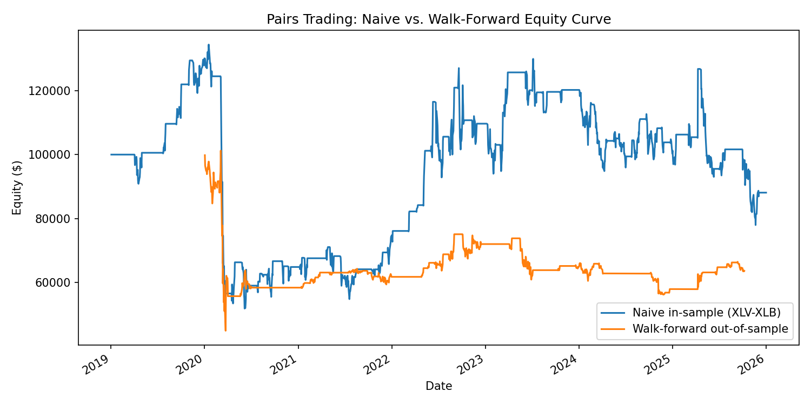

# Statistical Arbitrage & Pairs Trading Research Engine

A market-neutral statistical arbitrage research pipeline: cointegration screening, spread construction, signal generation, a cost-aware backtest engine, and walk-forward validation to avoid look-ahead bias.

This is a research tool, not a live trading system. The honest finding below (a negative out-of-sample Sharpe ratio on a sector-ETF universe) is reported deliberately, not hidden, because the point of walk-forward validation is to catch exactly this kind of gap between an in-sample-selected strategy and its true out-of-sample performance.

## Why walk-forward validation

Selecting a cointegrated pair once on the full price history and then backtesting on that same history is look-ahead bias: the pair was chosen *because* it worked over that period. This pipeline instead re-runs pair selection on a rolling formation window using only data available at that point in time, then evaluates performance strictly on the unseen trading window that follows. The two are reported side by side so the gap between them is visible, not smoothed over.

## Architecture

```
Price data (yfinance)
        |
Cointegration scan (Engle-Granger, all pairs in universe)
        |
Hedge ratio (OLS) + spread half-life (AR(1) mean-reversion speed)
        |
Rolling z-score of the spread
        |
Entry/exit signal generation (threshold-based, position persists between entry and exit)
        |
Backtest (transaction costs charged on position changes, not on holding)
        |
Walk-forward loop: repeat pair selection + backtest on rolling out-of-sample windows
        |
Metrics: Sharpe, max drawdown, CAGR, turnover, trade count
```

## Modules

| File | Responsibility |
|---|---|
| `src/data_loader.py` | Fetches and caches adjusted-close price data via yfinance |
| `src/cointegration.py` | Engle-Granger cointegration test across all pairs, OLS hedge ratio, spread half-life |
| `src/signal.py` | Rolling z-score of the spread, threshold-based entry/exit signal generation |
| `src/backtest.py` | Cost-aware backtest engine; transaction costs charged only on position changes |
| `src/metrics.py` | Sharpe ratio, max drawdown, CAGR, turnover |
| `src/walk_forward.py` | Rolling formation/trading window validation to prevent look-ahead bias |
| `main.py` | End-to-end pipeline: load data, scan pairs, backtest, walk-forward validate, plot |

## Running it

```bash
pip install -r requirements.txt
python main.py          # full pipeline against real market data
pytest tests/ -v         # 13 unit tests against synthetic, hand-calculable scenarios
```

## Results (10-sector-ETF universe, 2019-2026)

Three pairs passed the cointegration screen at p < 0.05: XLV-XLB, XLP-XLB, XLF-XLU.

**Naive full-history backtest** (pair selected and evaluated on the same data — optimistic by construction):

| Metric | Value |
|---|---|
| Sharpe ratio | 0.123 |
| Max drawdown | -61.5% |
| CAGR | -1.8% |
| Total return | -11.9% |
| Trades | 108 |

**Honest walk-forward out-of-sample performance** (pair re-selected on each rolling formation window, evaluated only on the unseen trading window that follows):

| Metric | Value |
|---|---|
| Sharpe ratio | -0.241 |
| Max drawdown | -55.7% |
| CAGR | -11.3% |
| Total return | -36.3% |
| Trades | 56 |



## What this actually shows

Sector ETFs are too correlated with the broad market to produce a clean, tradeable mean-reverting spread after realistic transaction costs (5 bps per side). Both the naive and walk-forward equity curves take a sharp hit in the March 2020 crash and never fully recover a durable edge. The walk-forward Sharpe is negative even though several individual windows show positive results (e.g. `XLK-XLY` at 3.34 in Q1 2021), which is itself informative: a strategy that only works in some regimes and not others is not a strategy, it's noise that occasionally aligns with the market.

The pipeline's job here is not to find alpha in ten sector ETFs — it's to build the infrastructure (cointegration screening, cost-aware backtesting, walk-forward validation) that would be needed to properly evaluate a stronger candidate universe (e.g. individual equity pairs within a sector, rather than sector-level indices).

## Testing

13 unit tests cover cointegration detection (both true positives and true negatives against synthetic series with known properties), hedge ratio recovery, signal entry/exit logic at threshold boundaries, and backtest P&L against hand-calculated expected values using round-number synthetic prices.

## Stack

Python, pandas, NumPy, statsmodels (Engle-Granger cointegration, OLS), yfinance, matplotlib, pytest.
